<div align="center">
  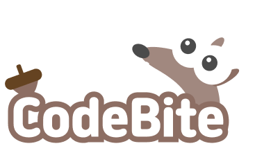
</div>

<div align="center">

KNU CodeBite 모바일 앱 프로젝트입니다. Expo 기반의 React Native 앱입니다.

CS 개념을 퀴즈 형식으로 학습하는 모바일 앱으로, 4지선다·OX·단답·매칭 등 다양한 문제 유형과 연속 학습 스트릭, 도토리 재화 시스템, 팔로우 기반 소셜 랭킹 등 게이미피케이션 요소를 결합한 학습 플랫폼입니다.

</div>

---

## 미리보기

<table>
  <tr>
    <td align="center" width="33%">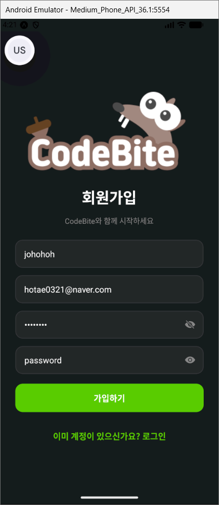<br/><sub>회원가입</sub></td>
    <td align="center" width="33%">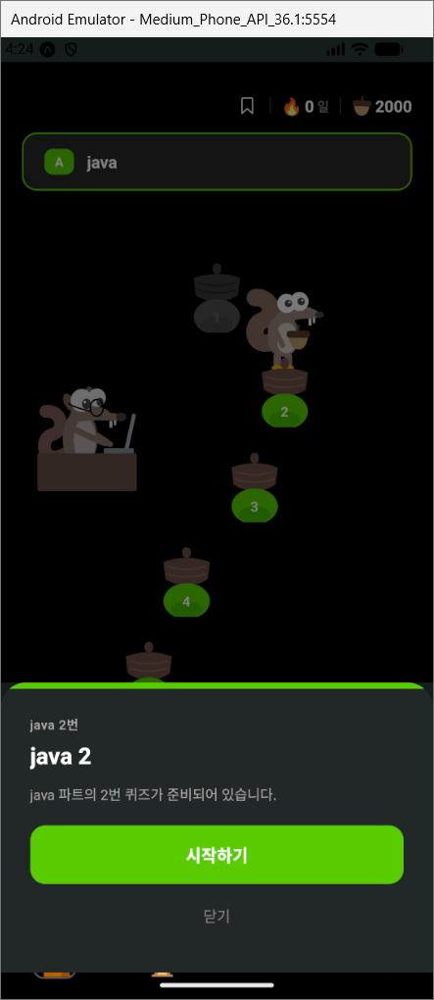<br/><sub>퀴즈 스테이지 맵</sub></td>
    <td align="center" width="33%">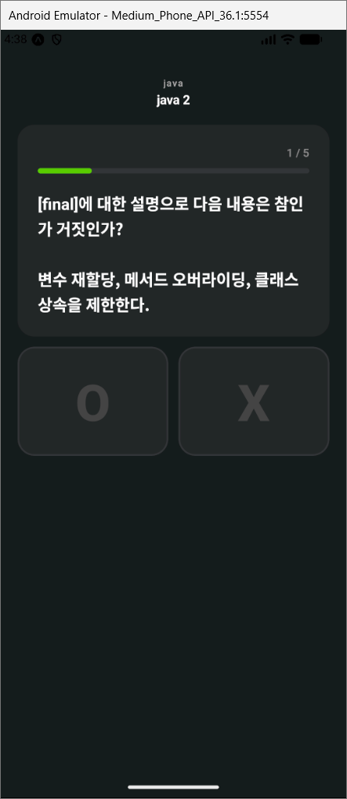<br/><sub>OX 퀴즈</sub></td>
  </tr>
  <tr>
    <td align="center">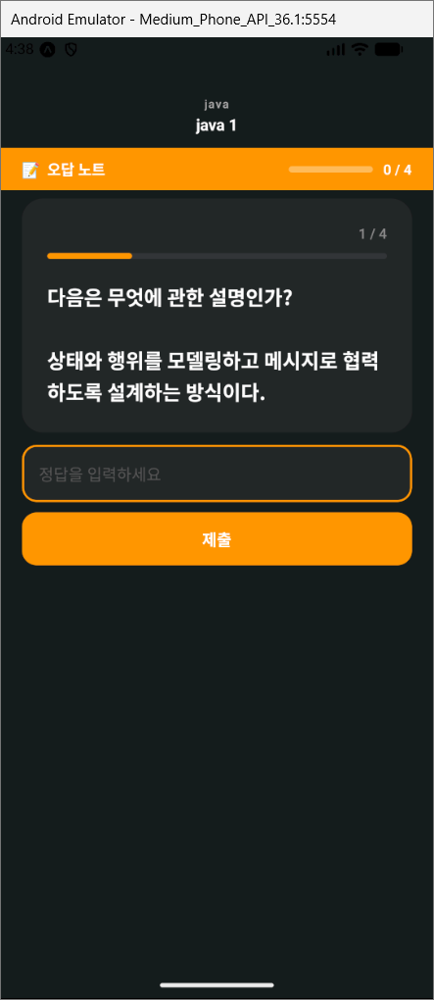<br/><sub>오답노트 (단답형)</sub></td>
    <td align="center">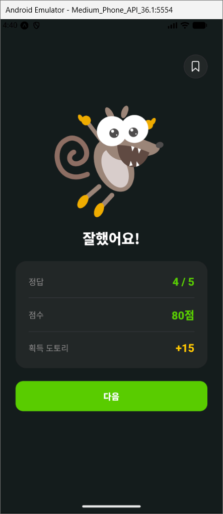<br/><sub>퀴즈 결과</sub></td>
    <td align="center">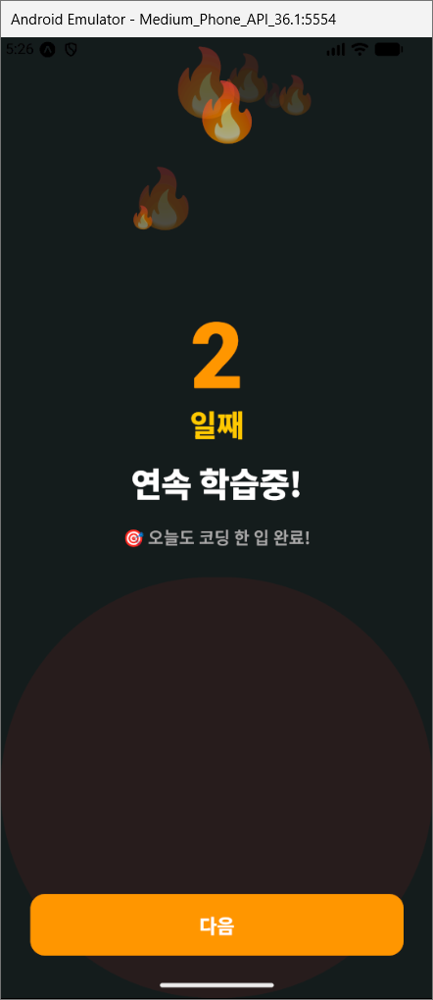<br/><sub>연속 학습 스트릭</sub></td>
  </tr>
  <tr>
    <td align="center">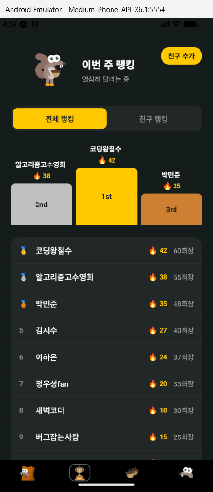<br/><sub>주간 랭킹</sub></td>
    <td align="center">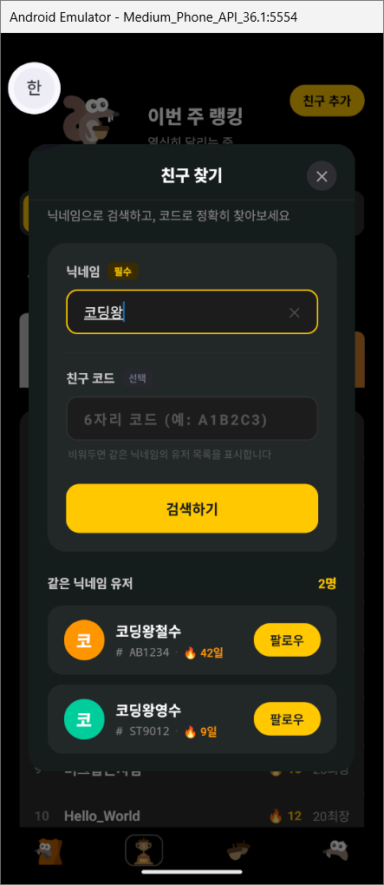<br/><sub>친구 찾기</sub></td>
    <td align="center">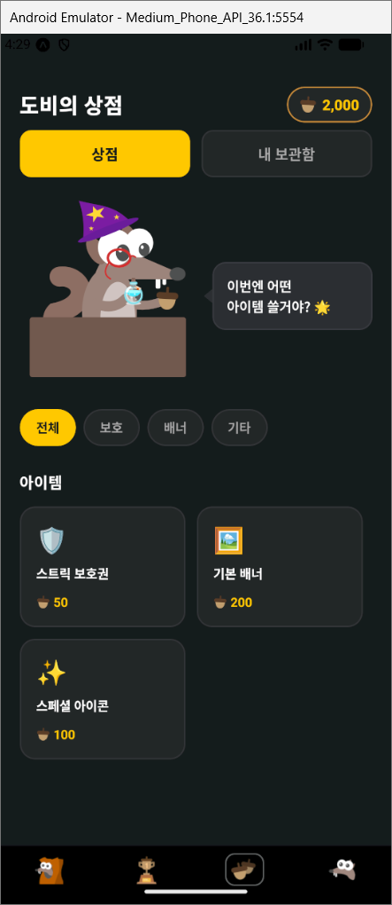<br/><sub>도토리 상점</sub></td>
  </tr>
  <tr>
    <td align="center">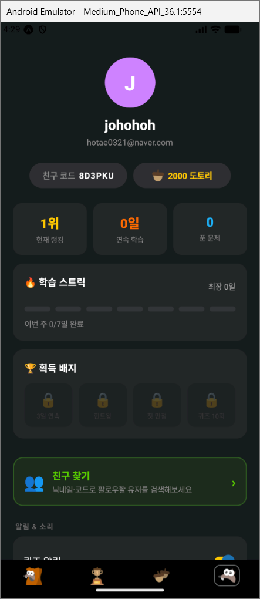<br/><sub>마이페이지</sub></td>
    <td align="center">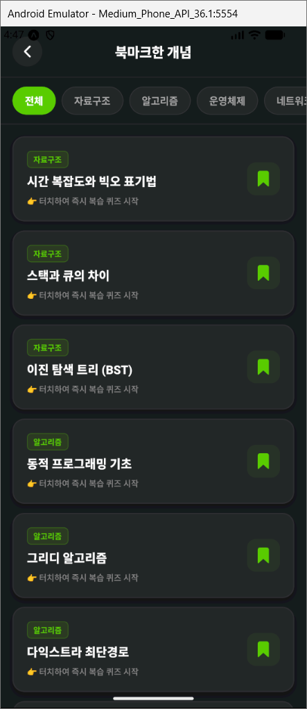<br/><sub>북마크한 개념</sub></td>
    <td align="center">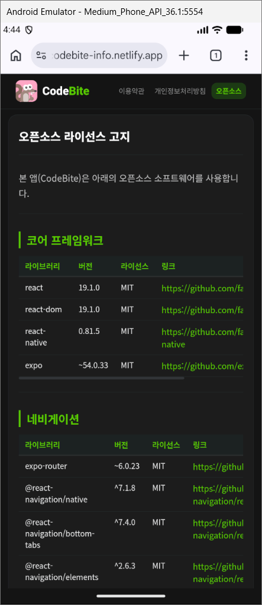<br/><sub>오픈소스 라이선스 고지</sub></td>
  </tr>
</table>

---

## 주요 기능

- **퀴즈 학습**: 자료구조·알고리즘·운영체제·네트워크 등 CS 개념을 4지선다·OX·단답형 문제로 학습
- **스테이지 맵**: 파트별로 구성된 로드맵을 따라 순차적으로 퀴즈를 진행
- **오답노트**: 틀린 문제만 모아 다시 풀며 복습
- **연속 학습 스트릭**: 매일 학습을 이어가며 스트릭을 쌓고 배지 획득
- **도토리 재화 & 상점**: 퀴즈를 풀어 얻은 도토리로 스트릭 보호권, 배너 등 아이템 구매
- **소셜 랭킹**: 닉네임/코드로 친구를 찾아 팔로우하고, 주간 랭킹으로 경쟁
- **북마크**: 헷갈리는 개념을 저장해두고 필요할 때 바로 복습 퀴즈 시작

---

## 프로젝트 구조

```
knu-codebite/
├── app/                  # 화면 (파일 기반 라우팅)
│   ├── (auth)/           # 로그인/인증 관련 화면
│   ├── (onboarding)/     # 온보딩 화면
│   ├── (social)/         # 친구 찾기 등 소셜 화면
│   ├── (tabs)/           # 탭 네비게이션 화면 (홈, 랭킹, 상점, 설정)
│   └── quiz/             # 퀴즈 화면
├── api/                  # 서버 통신 (axios, 인증/퀴즈/랭킹 등)
├── components/           # 공통 컴포넌트
├── constants/            # 상수 값
├── store/                # Zustand 상태 관리
├── types/                # TypeScript 타입 정의
└── assets/               # 이미지, 폰트 등 정적 파일
```

---

## 기술 스택

| 분류       | 기술                               |
| ---------- | ---------------------------------- |
| 프레임워크 | React Native + Expo ~54            |
| 라우팅     | Expo Router ~6                     |
| 상태 관리  | Zustand ^5                         |
| 서버 상태  | TanStack Query ^5                  |
| 애니메이션 | React Native Reanimated ~4, Lottie |
| 언어       | TypeScript ~5.9                    |

---

<div align="center">
  
  <br/>
  <sub>오늘도 코딩 한 입, CodeBite 🐿️</sub>
</div>
