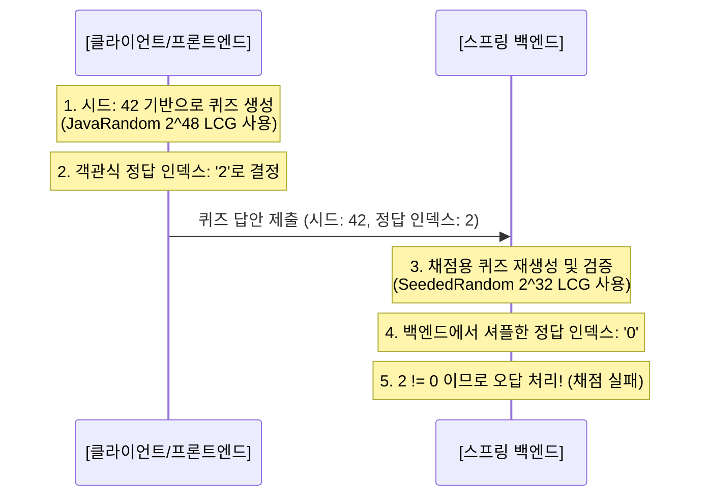

# 📝 CodeBite vs Question Generator: 퀴즈 로직 및 시드 동기화 심층 비교 분석 보고서

본 보고서는 **자기주도 프로젝트** 내 퀴즈 생성 시스템인 **CodeBite(프로덕션 서비스)**와 **Question Generator(시드 동기화 테스트 및 유틸리티)**의 퀴즈 생성 알고리즘, 난수 소비 메커니즘, 그리고 두 시스템 간의 설계 차이와 장단점을 비교·분석하여 논리적으로 정리한 문서입니다.

---

## 1. 개요 및 설계 목표

두 프로젝트 모두 **"클라이언트(프론트엔드)와 서버(백엔드)가 동일한 난수 시드(Seed)를 바탕으로 완벽히 동일한 퀴즈 구성(보기 순서, 셔플 상태 등)을 결정론적(Deterministic)으로 도출하고 검증한다"**는 동일한 시드 동기화 아키텍처 목표를 공유하고 있습니다.

그러나 실제 구현 세부 사항(난수 생성 엔진의 정밀도, 데이터 정렬 기준, 난수 소비 흐름)에 따라 신뢰성과 아키텍처적 일관성 측면에서 뚜렷한 차이를 보입니다.

---

## 2. 핵심 메커니즘 비교 분석

| 비교 기준                | CodeBite (프로덕션 서비스)                                                               | Question Generator (설계/검증용 유틸리티)                                                |
| :----------------------- | :--------------------------------------------------------------------------------------- | :--------------------------------------------------------------------------------------- |
| **난수 생성 엔진 (LCG)** | **백엔드**: Numerical Recipes LCG ($2^{32}$) **프론트엔드**: Java 표준 LCG ($2^{48}$) | **백엔드/프론트엔드 공통**: Java 표준 `java.util.Random` LCG ($2^{48}$)               |
| **원천 데이터 정렬**     | DB 내 기본 `id` 정렬 순서에 의존                                                         | `concept_id` 오름차순 ➔ `key` 오름차순 **명시적 이중 정렬**을 통한 순서 보장          |
| **중복 제거 및 정렬**    | 정렬되지 않은 원시 데이터를 그대로 사용                                                  | 중복 제거(`Set`) 후 **사전식 정렬** 후 사용 (JS/Java 엔진 간 해시맵 순서 불일치 방지) |
| **샘플링 기법**          | 템플릿 정보에 기반한 정밀 1대1 매핑                                                      | **Shuffle 후 slice(0, k)** 기법 적용 (난수 소비 동기화 일관성 확보)                   |

### 2.1. 난수 생성 알고리즘 비교

- **Numerical Recipes LCG ($2^{32}$ - CodeBite 백엔드)**:
  $$X_{n+1} = (1664525 \times X_n + 1013904223) \pmod{2^{32}}$$
- **Java 표준 LCG ($2^{48}$ - CodeBite 프론트엔드 및 Question Generator 공통)**:
  $$X_{n+1} = (25214903917 \times X_n + 11) \pmod{2^{48}}$$

---

## 3. 각 설계 방식의 장단점 분석

### 3.1. CodeBite (프로덕션 환경) 방식

> [!NOTE]  
> **아키텍처 요약**  
> 프론트엔드는 자바스크립트 표준 환경을 넘어서는 $2^{48}$ LCG 클래스를 자체 구현해 사용 중이나, 백엔드는 레거시 혹은 경량화 설계 목적의 $2^{32}$ LCG 수치해석 공식을 채택한 상태입니다.

#### 👍 장점

1. **경량화 및 직관적 구조**:
   - 백엔드의 `SeededRandom`이 32비트 연산만 수행하므로 매우 가볍고 직관적입니다.
2. **간결한 단답형 처리**:
   - 단답형 생성 시 난수를 완전히 생략하여 DB 자원이나 추가 연산을 소모하지 않습니다.
3. **독립적인 난수 제어**:
   - 각 퀴즈 타입별로 난수 인스턴스를 엄격히 개별 통제하여 오버헤드가 적습니다.

#### 👎 단점

1. **🚨 치명적인 난수 엔진 불일치 (채점 불능 버그)**:
   - 프론트엔드와 백엔드가 서로 다른 LCG 알고리즘($2^{48}$ vs $2^{32}$)을 사용하기 때문에, **동일한 시드값을 투입해도 셔플 결과 및 정답 인덱스가 무조건 다르게 생성**됩니다. 결과적으로 단답형을 제외한 모든 실시간 채점 제출(객관식, OX, 매칭형)이 정상 답안임에도 불구하고 서버 오답 처리가 발생합니다.
2. **비결정론적 데이터 의존성**:
   - DB 쿼리 결과 정렬에만 퀴즈 소스 데이터 순서를 의존하므로, 향후 DB 페이징 처리나 DBMS 분산 아키텍처 환경에 따라 시드가 꼬일 위험이 높습니다.
3. **해시 기반 순서 보장 부재**:
   - 중복 값 제거 단계에서 데이터의 사전식 정렬을 보장하지 않아, 언어 플랫폼(Java Map vs Javascript Object)의 내부 해시 버킷 분배 규칙 차이로 인해 미세한 무작위성 왜곡이 발생할 수 있습니다.

---

### 3.2. Question Generator (유틸리티/테스트) 방식

> [!TIP]  
> **아키텍처 요약**  
> 양방향 시드 완벽 호환을 핵심 전제로 삼고 있으며, BigInt를 활용한 $2^{48}$ LCG 동기화 및 난수 소비 횟수 엄격 매칭 기법을 채택하였습니다.

#### 👍 장점

1. **완벽한 결정론적 시드 동기화 (100% 검증 가능)**:
   - 양측 플랫폼 모두 Java의 표준 `java.util.Random` 알고리즘을 사용하므로, 동일 시드 인풋에 대해 생성 결과가 바이트 단위로 정확히 복제됩니다.
2. **다중 명시적 정렬을 통한 데이터 정합성 보장**:
   - `concept_id`와 `key`의 2중 명시적 오름차순 정렬 구조로 로딩 순서에 따른 난수 소비 어긋남을 완벽히 방지합니다.
3. **Set 자료형 사전식 정렬**:
   - 중복 제거 직후 사전순 정렬을 필수로 적용해, 플랫폼 및 브라우저 JS 엔진 종류에 영향을 받지 않는 신뢰성을 제공합니다.
4. **일관성 있는 샘플링 규격**:
   - 복잡한 확률적 샘플링 로직 대신 **Shuffle ➔ Slice**의 심플한 메커니즘을 적용하여 양측의 `nextInt` 호출 타이밍과 누적 난수 소비량을 완벽하게 일치시켰습니다.

#### 👎 단점

1. **BigInt 연산 오버헤드**:
   - JavaScript 및 Node.js 브라우저 환경에서 64비트 정수 연산을 시뮬레이션하기 위해 `BigInt` 자료형을 수시로 사용하여 미세한 연산 오버헤드가 발생할 수 있습니다.
2. **유연하지 못한 퀴즈 생성 흐름**:
   - 전체 퀴즈 유형이 하나의 선형 난수 소비 흐름(Pipeline)에 엮여 있어, 중간에 특정 문제 유형을 추가하거나 제외할 경우 이후 유형들의 모든 셔플 상태가 깨지게 됩니다.

---

## 4. 치명적인 실시간 검증 버그 진단

현재 프로덕션(`codebite`) 환경에서 발생하고 있는 **퀴즈 검증 실패 현상**의 원인은 다음과 같이 논리적으로 설명됩니다.

1. **프론트엔드**에서 난수 시드 `randomSeed`를 받아 **`JavaRandom`($2^{48}$ LCG)**을 구동해 보기를 섞고 퀴즈를 출제합니다.
2. **사용자**가 답안을 선택하여 **백엔드**로 전송합니다.
3. **백엔드(`ValidationService`)**는 채점 신뢰성을 위해 동일한 `randomSeed`로 가짜 퀴즈 세트를 재생성하여 검증을 시도합니다.
4. 그러나 백엔드는 **`SeededRandom`($2^{32}$ LCG)**을 사용하기 때문에 프론트엔드가 생성해 낸 보기의 셔플 순서나 OX 퀴즈의 참/거짓 판단 결과를 **전혀 재현하지 못하고 다른 순서로 생성**합니다.
5. 이에 따라 사용자가 올바른 정답을 골랐음에도 **인덱스가 어긋나 무조건 불일치(오답) 처리**가 됩니다.

---

## 5. 향후 개선 방향 및 권장 조치 (Action Items)

두 시스템의 장점을 결합하여 프로덕션 환경의 퀴즈 검증 무결성을 달성하기 위한 구체적인 솔루션 제안입니다.

### [Action 1] 백엔드 난수 엔진의 $2^{48}$ LCG 마이그레이션 (추천)

- 백엔드 `ValidationService.java` 내의 커스텀 LCG `SeededRandom` 클래스를 제거하고, Java 표준 `java.util.Random` 클래스로 전면 교체합니다.
- 이를 통해 프론트엔드의 `JavaRandom`과 완벽히 동일한 수식 레벨을 보장할 수 있습니다.

### [Action 2] 플랫폼 독립적 정렬 기준 이식

- 백엔드 및 프론트엔드 양측에 `distractors.sort()`를 통한 사전식 정렬을 강제하여, 플랫폼별 해시 보관 순서의 모호함을 해소합니다.

### [Action 3] 검증 테스트 강화

- `ValidationServiceTest.java`에 객관식(`MULTIPLE_CASE`), `OX`, `MATCHING` 유형에 대한 모의 채점 테스트 케이스를 구축하여, 난수 시드가 작동하는 시나리오가 100% 정확하게 패스하는지 정기적으로 검증합니다.
